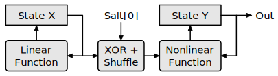
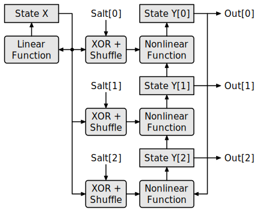
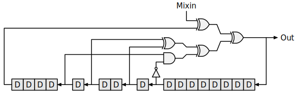
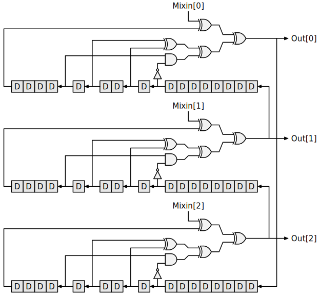

Xormix Algorithm
================

This document provides a short summary of the xormix algorithm. For a complete description, refer to the Python reference code (found in `python/reference`) or the generated VHDL/Verilog code.

Structure
---------

The xormix pseudorandom number generator consists of two stages. The first stage has `N` state bits where `N` can be 16, 24, 32, 48, 64, 96 or 128. The second stage has `N * S` state bits, where `S` is the number of parallel streams. The state of the first stage is referred to as `X`, the state of the second stage is referred to as `Y`. Each cycle, `X` is updated using a linear function that depends only on the previous value of `X`, while `Y` is updated using a nonlinear function that depends on both `X` and `Y`. `Y` also serves as the output of the random number generator.

For the simplest case with only one parallel output stream (i.e. `S` is 1), the random number generator is structured as shown in this block diagram:

When multiple parallel output streams are used, the first stage is identical and shared by all streams, whereas the second stage is separate for each stream:

The single-stream version of the algorithm produces N output bits per cycle. It is possible to produce more output at a lower cost per bit by using multiple parallel output streams. All streams share the same X stage, but use a separate Y stage. Each Y stage mixes in a copy of the same X state, but shuffled in a different way and with different bits inverted. Additionally, the Y update function of each stream takes its input from another stream, such that over time the Y states of the different streams are mixed together.

First stage
-----------

The first stage is fully linear and has N state bits. It is conceptually similar to a plain [xorshift](https://en.wikipedia.org/wiki/Xorshift) generator, however instead of using only simple bit shift operations, it combines bits in a more arbitrary way. This is possible at no extra cost because bit shuffling is essentially free in hardware. The update function is specifically chosen to have a period of `2**N - 1`, just like a xorshift generator. The exact definition of the X update function depends on `N`. As an example, the X update function for xormix16 is as follows:

	X'[ 0] = X[10] xor X[12] xor X[ 2] xor X[ 8] xor X[15]
	X'[ 1] = X[15] xor X[10] xor X[ 7] xor X[14] xor X[13] xor X[ 5]
	X'[ 2] = X[10] xor X[ 9] xor X[ 4] xor X[ 7] xor X[ 0]
	X'[ 3] = X[14] xor X[ 0] xor X[ 3] xor X[ 8] xor X[ 9] xor X[ 1]
	X'[ 4] = X[ 1] xor X[ 3] xor X[ 9] xor X[12] xor X[13]
	X'[ 5] = X[ 7] xor X[ 2] xor X[12] xor X[ 9] xor X[11] xor X[15]
	X'[ 6] = X[ 1] xor X[ 2] xor X[ 4] xor X[ 3] xor X[ 0]
	X'[ 7] = X[10] xor X[ 6] xor X[ 3] xor X[ 0] xor X[ 4] xor X[11]
	X'[ 8] = X[ 2] xor X[ 7] xor X[13] xor X[ 6] xor X[ 8]
	X'[ 9] = X[ 5] xor X[ 0] xor X[12] xor X[ 3] xor X[15] xor X[ 9]
	X'[10] = X[13] xor X[ 0] xor X[ 9] xor X[ 4] xor X[ 8]
	X'[11] = X[ 1] xor X[ 5] xor X[12] xor X[ 6] xor X[13] xor X[ 4]
	X'[12] = X[12] xor X[ 1] xor X[ 6] xor X[10] xor X[14]
	X'[13] = X[11] xor X[15] xor X[ 8] xor X[ 7] xor X[ 5] xor X[ 1]
	X'[14] = X[10] xor X[11] xor X[ 2] xor X[ 0] xor X[ 5]
	X'[15] = X[ 6] xor X[14] xor X[12] xor X[11] xor X[ 5] xor X[ 9]

Second stage
------------

The second stage is nonlinear and has `N * S` state bits. It uses a nonlinear invertible recurrence relation inspired by the [Trivium](https://en.wikipedia.org/wiki/Trivium_%28cipher%29) stream cipher. In addition to transforming the Y state, the recurrence relation also mixes in a shuffled version of the X state where some bits are inverted. The shuffling scheme is a crucial part of the parallel output stream mechanism described later. Like the X stage, the exact definition of the Y update function depends on `N`. For example, the recurrence relation used for xormix16 with a single output stream is shown in this block diagram:

When multiple parallel output streams are used, the recurrence relation becomes:

Note that in both cases, this recurrence relation is unrolled `N` times in order to produce `N * S` new state bits each cycle. The mixed-in data is simply the X state from the first stage, but shuffled and with some bits inverted:

	mixin[i][j] = (X xor salts[i])[(i + shuffle[j]) % N]

The salts and shuffle function again depend on `N`. For xormix16, they are:

	salts = [0xd2ba, 0xbc36, 0x16a6, 0xe3eb, 0xb749, 0x5bc4, 0x09f7, 0xf491,
	         0x5e28, 0x2d5a, 0xda5d, 0x2cab, 0x4058, 0x7547, 0xe94c, 0x0a05]
	shuffle = [4,  5, 14,  2,  9,  7,  3,  0, 10,  6, 13,  8, 11, 15,  1, 12]

As a result, the complete Y update function for xormix16 (with one stream) is as follows:

	Y'[ 0] = Y[ 0] xor (Y [ 4] and not Y [ 8]) xor Y [ 5] xor Y [ 7] xor not X[ 4]
	Y'[ 1] = Y[ 1] xor (Y [ 5] and not Y [ 9]) xor Y [ 6] xor Y [ 8] xor not X[ 5]
	Y'[ 2] = Y[ 2] xor (Y [ 6] and not Y [10]) xor Y [ 7] xor Y [ 9] xor not X[14]
	Y'[ 3] = Y[ 3] xor (Y [ 7] and not Y [11]) xor Y [ 8] xor Y [10] xor     X[ 2]
	Y'[ 4] = Y[ 4] xor (Y [ 8] and not Y [12]) xor Y [ 9] xor Y [11] xor not X[ 9]
	Y'[ 5] = Y[ 5] xor (Y [ 9] and not Y [13]) xor Y [10] xor Y [12] xor not X[ 7]
	Y'[ 6] = Y[ 6] xor (Y [10] and not Y [14]) xor Y [11] xor Y [13] xor not X[ 3]
	Y'[ 7] = Y[ 7] xor (Y [11] and not Y [15]) xor Y [12] xor Y [14] xor     X[ 0]
	Y'[ 8] = Y[ 8] xor (Y [12] and not Y'[ 0]) xor Y [13] xor Y [15] xor     X[10]
	Y'[ 9] = Y[ 9] xor (Y [13] and not Y'[ 1]) xor Y [14] xor Y'[ 0] xor     X[ 6]
	Y'[10] = Y[10] xor (Y [14] and not Y'[ 2]) xor Y [15] xor Y'[ 1] xor     X[13]
	Y'[11] = Y[11] xor (Y [15] and not Y'[ 3]) xor Y'[ 0] xor Y'[ 2] xor     X[ 8]
	Y'[12] = Y[12] xor (Y'[ 0] and not Y'[ 4]) xor Y'[ 1] xor Y'[ 3] xor     X[11]
	Y'[13] = Y[13] xor (Y'[ 1] and not Y'[ 5]) xor Y'[ 2] xor Y'[ 4] xor not X[15]
	Y'[14] = Y[14] xor (Y'[ 2] and not Y'[ 6]) xor Y'[ 3] xor Y'[ 5] xor not X[ 1]
	Y'[15] = Y[15] xor (Y'[ 3] and not Y'[ 7]) xor Y'[ 4] xor Y'[ 6] xor not X[12]

Seeding procedure
-----------------

### Full seeding procedure

The xormix PRNG should be seeded by setting the entire state to a random value. Any value is acceptable with one exception: the X state should always be nonzero. Appropriate seeds can be generated with the xormix command-line tool (`xormix-tool`), which implements the following algorithm:

	do {
		X = random();
	} while(X == 0);
	for(i = 0; i < S; ++i) {
		Y[i] = random();
	}

### Simplified seeding procedure

Sometimes it is more convenient to seed the entire PRNG with a smaller seed. For this purpose a simplified seeding procedure can be used. In this case, all Y states are set to the same value. After this, the first few outputs of the PRNG should be discarded since these are not very random. Based on randomness testing with PractRand it appears that discarding 4 cycles worth of output is sufficient to ensure that the state has been mixed up sufficiently regardless of the word size or number of streams. The simplified seeding procedure is described by the following algorithm:

	// initialize the PRNG
	do {
		X = random();
	} while(X == 0);
	Y[0] = random();
	for(i = 1; i < S; ++i) {
		Y[i] = Y[0]
	}
	
	// discard the first 4 cycles worth of output
	for(i = 0; i < 4; ++i) {
		next_state();
	}
