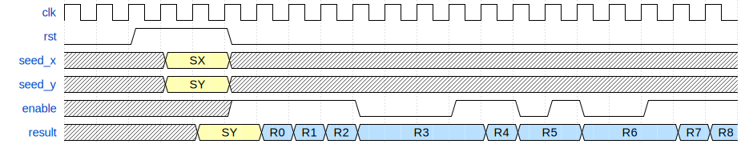

Xormix Hardware Module (VHDL/Verilog) Interface
===============================================

This document describes the interface of the xormix hardware modules that can be found in the `vhdl` and `verilog` directories. The VHDL and Verilog implementations are identical in functionality and interface.

These modules were intentionally kept as simple as possible, for this reason they do not include flow control or seed management. It is expected that users will modify these modules to meet the requirements of their application. The recommended seeding procedure is described on the [Xormix Algorithm](doc/algorithm.md) page.

The following hardware modules are available:

- xormix16
- xormix24
- xormix32
- xormix48
- xormix64
- xormix96
- xormix128

All modules have the same interface:

| Port   | Direction | Type       | Size  | Description                                       |
| ------ | --------- | ---------- | ----- | ------------------------------------------------- |
| clk    | input     | bit        | 1     | Clock                                             |
| rst    | input     | bit        | 1     | Synchronous reset/reseed signal, active high      |
| seed_x | input     | bit vector | N     | X seed value (first stage), applied during reset  |
| seed_y | input     | bit vector | S * N | Y seed value (second stage), applied during reset |
| enable | input     | bit        | 1     | Enable input, advances the PRNG to the next value |
| result | output    | bit vector | S * N | Random data output, registered                    |

The following timing diagram shows the typical usage of the module:

